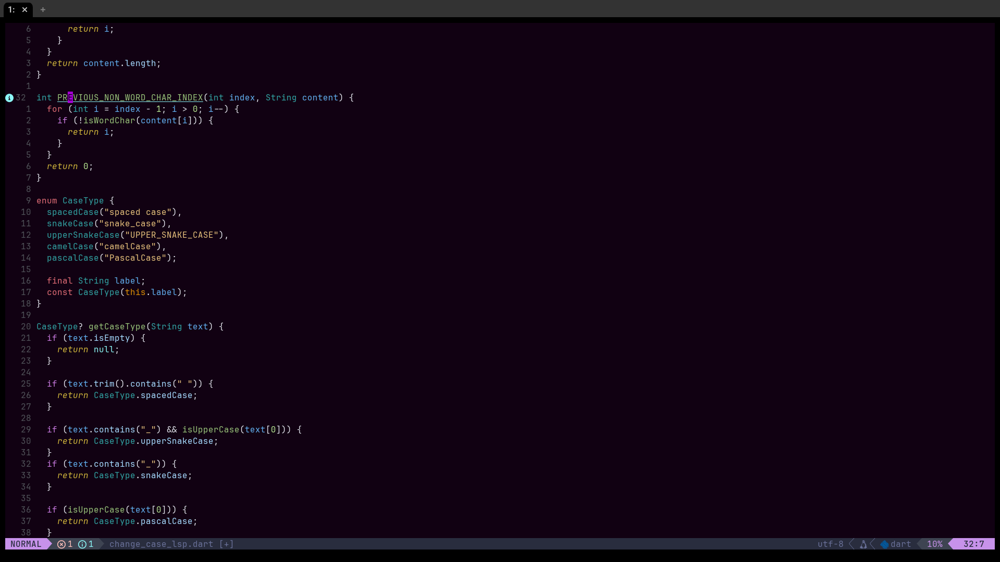
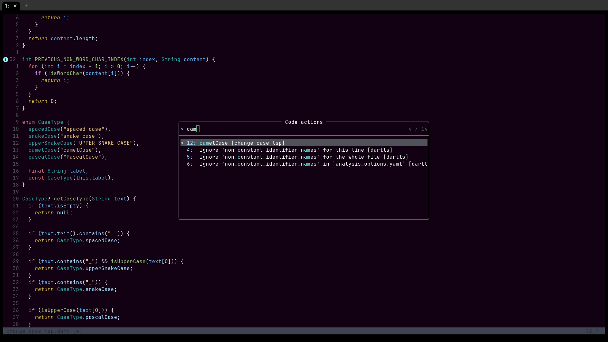
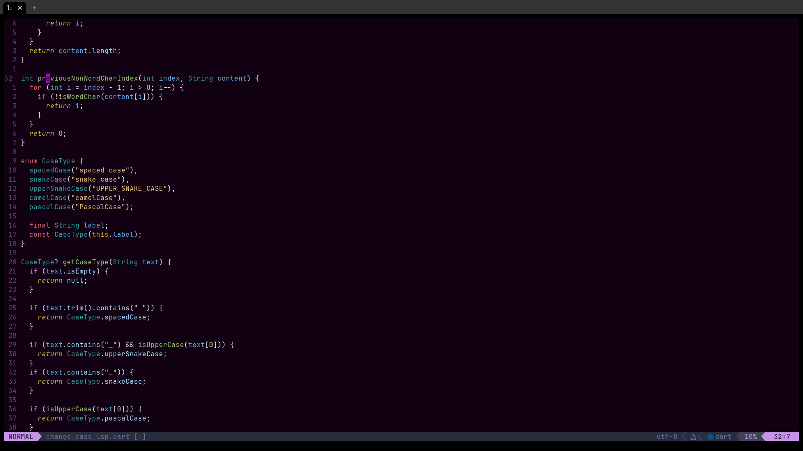
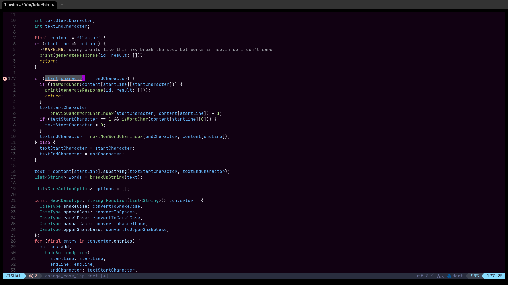
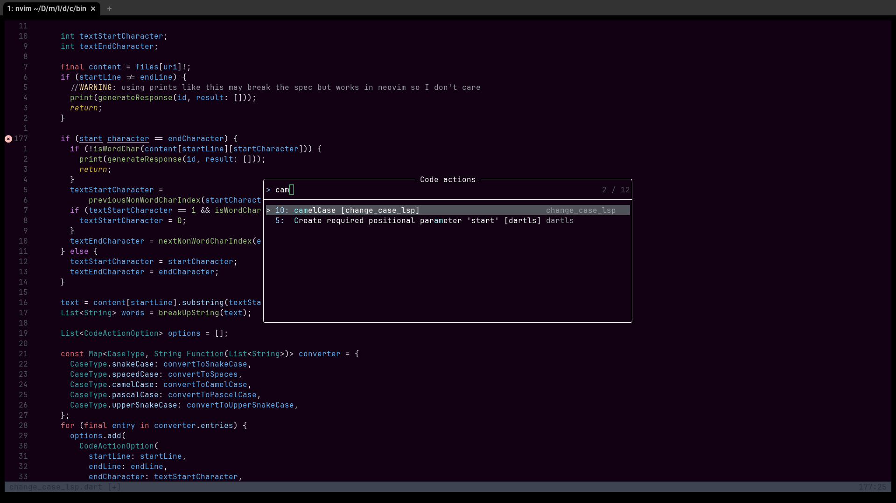
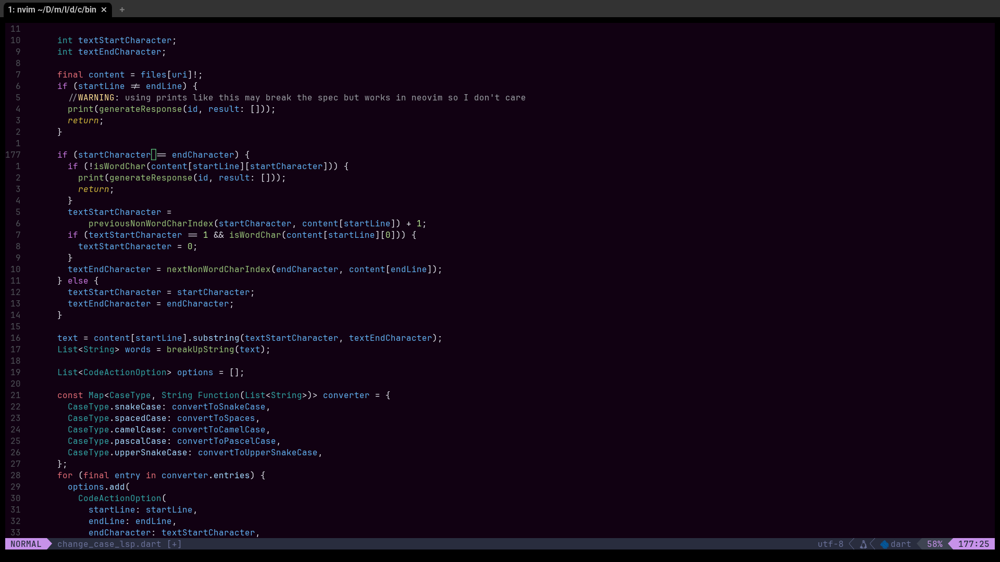

# change case lsp
a proof of concept lsp that provides a code action that allows you to convert the text under your courser between camel, pacal, and snake case both in the lowercase form and the SNAKE_CASE form. You can also convert the text to be space separated  

## Limitations

This lsp server only supports communication over stdio and not tcp. Most editors use this by default but if your's doesn't then you'll have to figure out how to change it. 

you can convert to space sperated text though there is not much ability to convert from it, unless you highlight the text in visual mode or with your cursor before you trigger the code action. 

the code has only be tested on linux with neovim, and there aren't any unit test, though I also haven't encountered any errors like I stated above this is more a proof of concept then anything, though if you run into any problems I can try to fix them.

I also didn't use any libraries or desearlize lsp messages in the nicest of ways as I wrote a good portion of the code with a CharaCorder, which I am still getting used to so I wasn't the most patient with how I handled everything, plus once again it was more a proof of concept and honstly just a project for me to practice with  the characorder then something I would actually use, as such there is no real error handling. Having said that one of the reasons I wrote this project was to try to use it with the characorder because of how it handles separators I thought I could start of in snake case then convert to whatever I need, though of course you don'e need a characroder to use this project.
## Installation
you need the dart programing language to compile the project
after you do that clone the repo, cd into the project, then into bin, and run dart compile exe change_case_lsp.dart

then you need to set it up to work with your lsp client, probably a text editior.
For neovim you will probably want to add something like this to add this code snippet to run in your initit.lua

```lua
vim.api.nvim_create_autocmd({ "BufRead", "BufNewFile" }, {
  callback = function(args)
    if vim.fn.filereadable(args.file) == 1 then
      --@diagnostic disable-next-line: missing-fields
      vim.lsp.start({
        name = "change_case_lsp",
        cmd = { "<FULL_PATH_TO_EXECUTABLE>" },
        root_dir = vim.fs.dirname(args.file),
      })
    end
  end,
})

```
the path to executable should be the full path to the compiled LSP, note for linux users make sure you don't use ~ for your home directory in the path neovim doesn't like that you need to use /home/\<name\> I don't know why.  

Having said that vscode and windows/macos users, you are on your own I have no idea how those ecosystems work.

## demonstrations
note I only showed converting to camel case though you can convert to any of the other described cases.
<p align="center">
  <div></div>
  <div></div>
  <div></div>
  <div></div>
  <div></div>
  <div></div>
</p>
